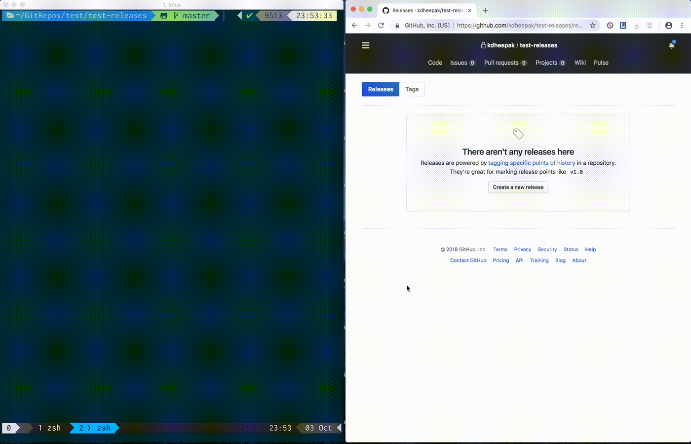
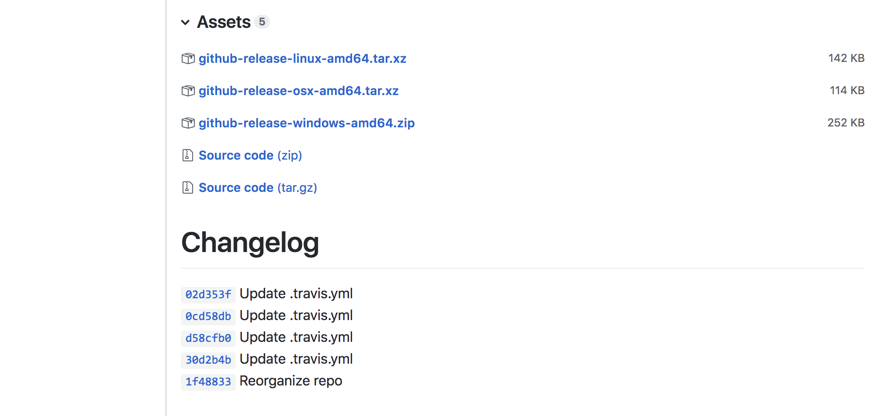

# github-release

`github-release` is a command line utility tool that allows you to easily manage your releases on GitHub.
You can create releases, remove releases and upload files to existing releases using this tool.



`github-release` uses [GitHub v3 API](http://developer.github.com/v3/repos/releases).

- [# Setup](#-setup)
- [# Create a release](#-create-a-release)
- [# Remove a release](#-remove-a-release)
- [# Upload a file to a release](#-upload-to-a-release)
- [# Documentation](#-documentation)

### # Setup

You can download the latest binaries from [here](https://github.com/kdheepak/github-release/releases). Binaries are available for Windows, Mac and Linux.
Additionally, you will need a GitHub Personal Access Token to manage your releases.
Go to [this page](https://github.com/settings/tokens) and click generate a new token, enter your password and select the necessary permissions. You may need just `repo` permissions on the token to manage your releases. Click Generate Token at the bottom of the screen and copy the token to a safe location. DO NOT SHARE THIS TOKEN ON THE INTERNET.

Once you've downloaded the binary, unzip it. On OSX for example, you can type the following in a command line to download and unzip the file.

```bash
curl -LO 'https://github.com/kdheepak/github-release/releases/download/v0.1.4/github-release-osx-amd64.tar.xz'
tar -xvf github-release-osx-amd64.tar.xz
```

You can run the command using the following:

```bash
./github-release-osx-amd64/github-release help
```

### # Create a release

The following will create a release named `v0.1.4` on a repo called `github-release` under the username `kdheepak` if it doesn't already exist.

```bash
github-release create -t $GITHUB_TOKEN -o kdheepak -r github-release --tag v0.1.4
```

Creating a release will also by default add a changelog based on all the commits from the previous tag to the most recent tag.



You can specify any custom text by setting the `--body` flag in the command line.

### # Remove a release

The following will remove a release named `v0.1.4` on a repo called `github-release` under the username `kdheepak` if it exists.

```bash
github-release remove -t $GITHUB_TOKEN -o kdheepak -r github-release --tag v0.1.4
```

### # Upload to a release

The following will upload the `./bin/github-release` file to a release named `v0.1.4` on a repo called `github-release` under the username `kdheepak` if there is no file already that exists by the same name and if the tag / release already exists.

```
github-release upload -t $GITHUB_TOKEN -o kdheepak -r github-release --tag v0.1.4 --file ./bin/githubr-release
```

### # Documentation

```bash
Usage:
  github-release subcommand [subcommand-opts & args]
where subcommand syntaxes are as follows:

  upload [required&optional-params]
    Options(opt-arg sep :|=|spc):
      -h, --help                       write this help to stdout
      -t=, --token=  string  REQUIRED  set token
      -o=, --owner=  string  REQUIRED  set owner
      -r=, --repo=   string  REQUIRED  set repo
      -f=, --file=   string  REQUIRED  set file
      --tag=         string  REQUIRED  set tag

  create [required&optional-params]
    Options(opt-arg sep :|=|spc):
      -h, --help                          write this help to stdout
      -t=, --token=     string  REQUIRED  set token
      -o=, --owner=     string  REQUIRED  set owner
      -r=, --repo=      string  REQUIRED  set repo
      --tag=            string  REQUIRED  set tag
      --target_commit=  string  "master"  set target_commit
      -n=, --name=      string  ""        set name
      -b=, --body=      string  ""        set body
      -d, --draft       bool    false     set draft
      -p, --prerelease  bool    false     set prerelease

  remove [required&optional-params]
    Options(opt-arg sep :|=|spc):
      -h, --help                       write this help to stdout
      -t=, --token=  string  REQUIRED  set token
      -o=, --owner=  string  REQUIRED  set owner
      -r=, --repo=   string  REQUIRED  set repo
      --tag=         string  REQUIRED  set tag

  logs [optional-params]
    Options(opt-arg sep :|=|spc):
      -h, --help                write this help to stdout
      -p, --pretty  bool  true  set pretty

  version [optional-params]
    Options(opt-arg sep :|=|spc):
      -h, --help                write this help to stdout
      -p, --pretty  bool  true  set pretty
```
